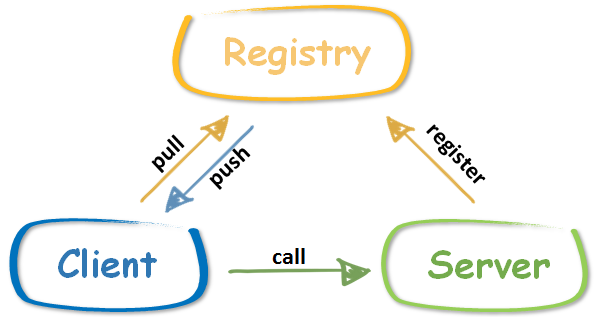

RPCx
------

rpcx是一个类似阿里巴巴 Dubbo 和微博 Motan 的分布式的RPC服务框架，基于Golang net/rpc实现.  

rpcx的目标就是实现一个Go生态圈的Dubbo，为Go生态圈提供一个分布式的、多插件的、带有服务治理功能的产品级的RPC框架。

Go生态圈已经有一些RPC库，如官方的net/rpc、grpc-go、gorilla-rpc等，为什么还要开发rpcx呢？

原因在于尽管这些框架都是为Go实现的RPC库，但是它们的功能比较单一，只是实现了点对点(End-to-End)的通讯框架。缺乏服务治理的功能，比如服务注册和发现、
负载均衡、容灾、服务监控等功能


RPC是什么
--------

远程过程调用（英语：Remote Procedure Call，缩写为 RPC）是一个计算机通信协议。该协议允许运行于一台计算机的程序调用另一台计算机的子程序，而程序员无需额外地为这个交互作用编程。如果涉及的软件采用面向对象编程，那么远程过程调用亦可称作远程调用或远程方法调用，例：Java RMI。
简单地说就是能使应用像调用本地方法一样的调用远程的过程或服务。很显然，这是一种client-server的交互形式，调用者(caller)是client,执行者(executor)是server。典型的实现方式就是request–response通讯机制。

RPC 是进程之间的通讯方式(inter-process communication, IPC), 不同的进程有不同的地址空间。
如果client和server在同一台机器上，尽管物理地址空间是相同的，但是虚拟地址空间不同。
如果它们在不同的主机上，物理地址空间也不同。

RPC的实现的技术各不相同，也不一定兼容。

一个正常的RPC过程可以分成下面几步：
* (1) client调用client stub，这是一次本地过程调用
* (2) client stub将参数打包成一个消息，然后发送这个消息。打包过程也叫做 marshalling
* (3) client所在的系统将消息发送给server
* (4) server的的系统将收到的包传给server stub
* (5) server stub解包得到参数。 解包也被称作 unmarshalling
* (6) 最后server stub调用服务过程. 返回结果按照相反的步骤传给client

RPC只是描绘了 Client 与 Server 之间的点对点调用流程，包括 stub、通信、RPC 消息解析等部分，在实际应用中，还需要考虑服务的高可用、负载均衡等问题，所以产品级的 RPC 框架除了点对点的 RPC 协议的具体实现外，还应包括服务的发现与注销、提供服务的多台 Server 的负载均衡、服务的高可用等更多的功能。
目前的 RPC 框架大致有两种不同的侧重方向，一种偏重于服务治理，另一种偏重于跨语言调用。

服务治理型的 RPC 框架有 Dubbo、DubboX、Motan 等，这类的 RPC 框架的特点是功能丰富，提供高性能的远程调用以及服务发现及治理功能，适用于大型服务的微服务化拆分以及管理，对于特定语言（Java）的项目可以十分友好的透明化接入。但缺点是语言耦合度较高，跨语言支持难度较大。

跨语言调用型的 RPC 框架有 Thrift、gRPC、Hessian、Hprose 等，这一类的 RPC 框架重点关注于服务的跨语言调用，能够支持大部分的语言进行语言无关的调用，非常适合于为不同语言提供通用远程服务的场景。但这类框架没有服务发现相关机制，实际使用时一般需要代理层进行请求转发和负载均衡策略控制。

本项目 rpcx 属于服务治理类型，是一个基于 Go 开发的高性能的轻量级 RPC 框架，Motan 提供了实用的服务治理功能和基于插件的扩展能力。


RPCX的特点
----------

rpcx使用Go实现，适合使用Go语言实现RPC的功能。
* 基于net/rpc,可以将net/rpc实现的RPC项目轻松的转换为分布式的RPC
* 插件式设计，可以配置所需的插件，比如服务发现、日志、统计分析等
* 基于TCP长连接,只需很小的额外的消息头
* 支持多种编解码协议，如Gob、Json、MessagePack、gencode、ProtoBuf等
* 服务发现：服务发布、订阅、通知等，支持多种发现方式如ZooKeeper、Etcd等
* 高可用策略：失败重试（Failover）、快速失败（Failfast）
* 负载均衡：支持随机请求、轮询、低并发优先、一致性 Hash等
* 规模可扩展，可以根据性能的需求增减服务器
* 其他：调用统计、访问日志等

rpcx目标是轻量级的，小而简单，但是期望所有的功能都可以通过插件的方式搭积木的方式完成


RPCX架构
--------

rpcx中有服务提供者 RPC Server，服务调用者 RPC Client 和服务注册中心 Registry 三个角色:
* Server 向 Registry 注册服务，并向注册中心发送心跳汇报状态(基于不同的registry有不同的实现)
* Client 需要向注册中心查询 RPC 服务者列表，Client 根据 Registry 返回的服务者列表，选取其中一个 Sever 进行 RPC 调用
* 当 Server 发生宕机时，Registry 会监测到服务者不可用(zookeeper session机制或者手工心跳)，Client 感知后会对本地的服务列表作相应调整。client可能被动感知(zookeeper)或者主动定时拉取
* 可选地，Server可以定期向Registry汇报调用统计信息，Client可以根据调用次数选择压力最小的Server



当前rpcx支持zookeeper, etcd, Consul等注册中心.

rpcx基于Go net/rpc的底层实现， Client和Server之间通讯是通过TCP进行通讯的，它们之间通过Client发送Request，Server返回Response实现。
Request和Response消息的格式都是Header+Body的格式。Header和Body具体的格式根据编码方式的不同而不同，可以是二进制，也可以是结构化数据如JSON。


RPCX的特性
---------

rpcx拥有众多特性。
### 服务器特性
#### 编码 (序列化)

rpcx当前支持多种序列化/反序列化的方式，可以根据需求选择合适的编码库:  

|特性 	|功能描述|
|:--------|:--------|
|gob  | 	官方提供的序列化方式，基于一个包含元数据的流|
|jsonrpc 	|也是官方提供的编码库，以JSON格式传输 |
|msgp 	|类似json格式的编码，但是更小更快，可以直接编码struct|
|gencode 	|一个超级快的序列化库，需要定义schema,但是定义方式和struct类似|
|protobuf 	|Google推出的广受关注的序列化库，推荐使用gogo-protobuf，可以获得更高的性能|

在数据结构简单的情况下，这几种库都可以满足需求。但是如果追求性能，建议采用后面三种序列化库。

序列化库的选择对于RPC服务的影响是巨大的，我创建了另外一个项目专门比较各序列化库的性能： gosercomp。

新的序列化库的实现也非常简单，只需实现下面两个方法即可：
```go
func NewXXXXXServerCodec(conn io.ReadWriteCloser) rpc.ServerCodec {
    ……
}
func NewXXXXXClientCodec(conn io.ReadWriteCloser) rpc.ClientCodec {
    ……
}
```

编码库负责marshal/unmarshal Reuqest/Response， 包括消息中的Header和Body。
如果你想，你也可以对Header和Body实现不同的编码。

#### 注册中心
目前提供了四种注册中心: zookeeper, etcd, consul, boltdb.

##### **ZooKeeperRegisterPlugin**
通过ZooKeeper实现服务发现.  
服务在注册的时候会自动在ZooKeeper上创建一个Ephemeral节点，因此当服务宕机的时候此节点就被删除，Client也会感知到.  
同时，Server也会把调用次数定时更新到ZooKeeper，这样Client可以根据一段时间的调用次数选择压力较小的服务器节点进行连接。

注册中心的配置只需在服务器初始化的时候增加以下代码，服务的实现无需做任何的改动，也不需要额外的配置。
```go
plugin := &ZooKeeperRegisterPlugin{
	ServiceAddress:   "tcp@127.0.0.1:1234",
	ZooKeeperServers: []string{"127.0.0.1:2181"},
	BasePath:         "/betterrpc",
	metrics:          metrics.NewRegistry(),
	Services:         make([]string, 1),
	updateInterval:   time.Minute,
}
server.PluginContainer.Add(plugin)
```

其中ServiceAddress为本机(Server)要暴露给Client地址。因为ZooKeeper的节点名不支持"/"，
所以此处用"@"代替"://".  
ZooKeeperServers为ZK集群的地址.  
BasePath为一个服务组，此组下的服务对于Client都是可见的。

##### EtcdRegisterPlugin
通过etcd也可以实现服务发现.  
etcd可以通过TTL判断服务器的存活，另外此插件也会定时把调用次数定时更新到etcd.  
此插件可以使用下面的代码配置：
```go
plugin := &EtcdRegisterPlugin{
	ServiceAddress: "tcp@127.0.0.1:1234",
	EtcdServers:    []string{"http://127.0.0.1:2379"},
	BasePath:       "/betterrpc",
	metrics:        metrics.NewRegistry(),
	Services:       make([]string, 1),
	updateInterval: time.Minute,
}
server.PluginContainer.Add(plugin)
```
注意注册中心插件必须在配置服务之前设置，否则注册中心无法获取要注册的服务信息。

##### 扩展点
当前rpcx为server提供了以下扩展点：
* 服务注册时
* Client连接时
* 读取Request Header的前后
* 读取Request Body的前后
* 返回Response的前后

可以根据这些扩展点编写自己的插件，只需实现相应的接口即可。
定义的接口可以看godoc的IXXXXXXPlugin的定义。

上面介绍的注册中心就是通过插件的方式实现。同时rpcx还实现了其它的插件，如下面的介绍。
* LogRegisterPlugin: 记录服务注册日志
* MetricsPlugin: 统计服务调用次数和处理时间
* RateLimitingPlugin: 限流操作，限定服务器的TPS

#### 客户端特性
##### 负载均衡
负载均衡是通过不同的ClientSelector来实现的.  
|:负载均衡器 |: 功能描述 |  
|:--------|:--------|
|DirectClientSelector |	点对点的直连，客户端直接连接一个服务器|
|MultiClientSelector  |	多对多的直连，一个客户端可以从一组固定的服务器中选择一个直连，无需注册中心 |
|ZooKeeperClientSelector |	从ZK注册中心选择一个服务器连接 |
|EtcdClientSelector |	从Etcd注册中心选择一个服务器连接 |

一个Selector需要实现ClientSelector接口：
```go
type ClientSelector interface {
	Select(clientCodecFunc ClientCodecFunc) (*rpc.Client, error)
}
```
Client的序列化方式必须和服务器的序列化方式保持一致。

##### 容错
Client提供了三种容错方式: Failfast、Failover、Failtry:
* Failfast: 如果Client调用失败，立即返回，不会重试
* Failover: 如果Client调用失败，会尝试从服务列表中选择另外一个服务器调用，直到成功或者到达重试次数
* Failtry： 如果Client调用失败，会继续这个服务器重试，直到成功或者到达重试次数

##### 重选算法
对于多个服务器，重选发送支持：
* 随机选择： 随机选择一个服务器并返回，可能和上一次的重复
* RoundRobin: 按顺序选择一个服务器
* 一致性哈希 [TODO]:使用Jump Consistent Hash algorithm
* CallLeast [TODO]: 根据调用次数选择压力最小的服务器

### 扩展点
Client的扩展点如下：
* 读取Response Header的前后
* 读取Response Body的前后
* 写Request的前后
